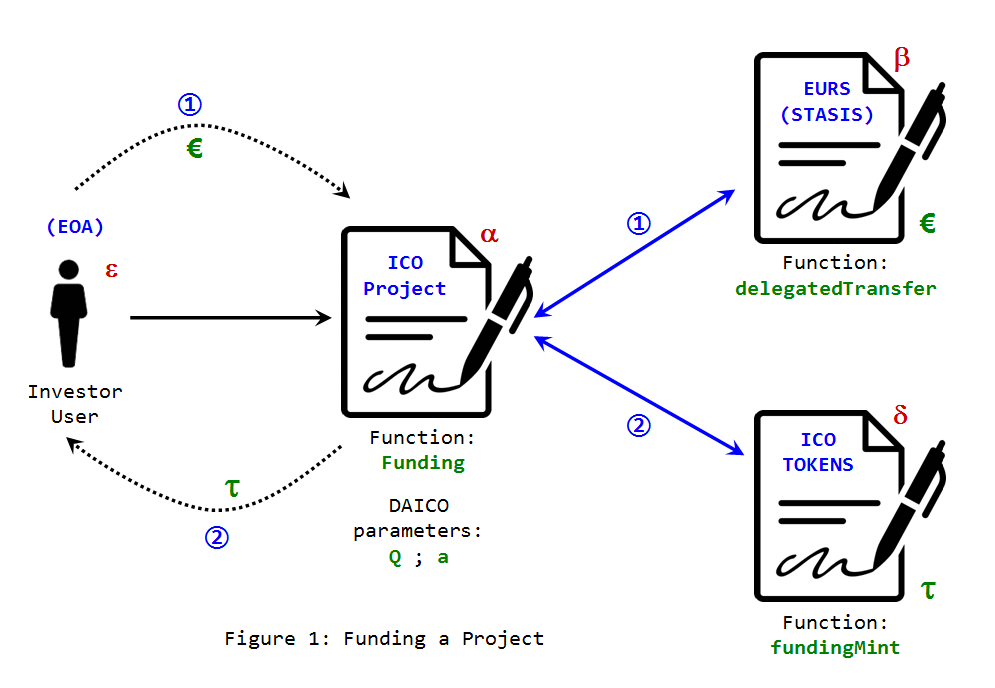
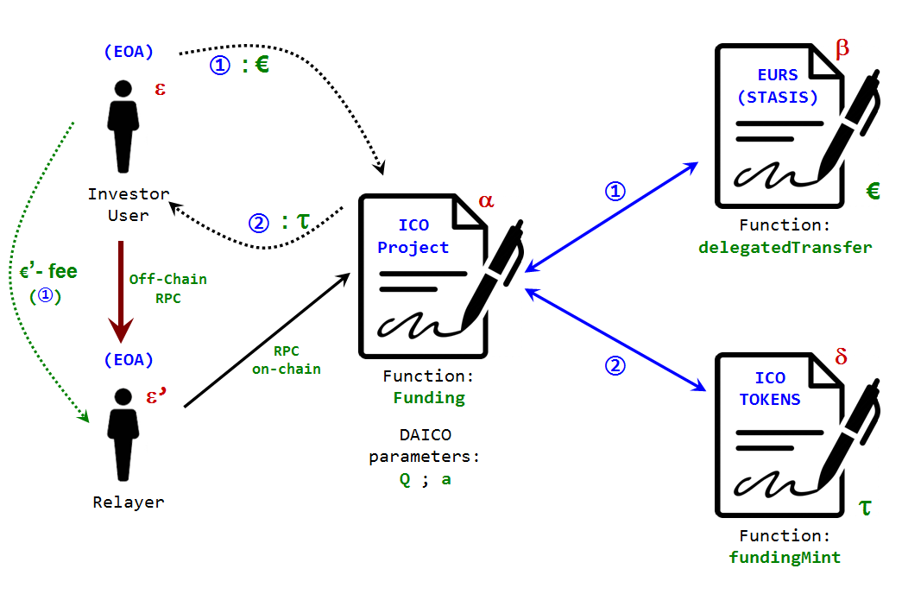

## An Analisis of **_delegatedTransfer_** Function and its Advantages over **_approve_** Standard Function

A function with the strategy of doing transfer of funds with delegation by the means of signatures, as a possibility and a good idea has been around [*since some time ago*](https://hackernoon.com/you-dont-need-ether-to-transfer-tokens-f3ae373606e1). But concerning stable coins the first team I have notice to have implemented such idea on production is [STASIS-EURS](https://stasis.net/). Let's see what practical uses this new tool may have.  

**The Innovation of the Function _delegatedTransfer_**: many times innovation consists of simple changes that had not been taken seriously before, but when implemented, they highlight how relevant they are for the adoption of a technology.

If the intention of using stable coins, is to promote an adoption that somehow breaks the barrier of the network effect, we need the end user to use this technology without requiring advanced knowledge of what is happening within their application. And one of those barriers is the need to pay commissions of *Gas* in ethers, in order to be able to mobilize funds that exist in another totally different currency: euros and dollars!

How do we explain to the ordinary user that those dollars he wishes to send, will not move from his wallet unless he acquires and places in his same "*address*" a sufficient amount of *ethers*? That is, it was not enough to buy the *Tokens* in stable coin (either dollars or euros), another complex process must also be done to acquire a cryptocurrency, which in principle does not interest the user or does not have to interest to him/her at all; and all this just to buy a magazine, a coffee or pay the utility bill.

This is the technological contribution of the function **_delegatedTransfer_** whose mission is to avoid the end user the need to deal with a cryptocurrency, when his field of action is concentrated in a different currency. The STASIS team developed an application, available for mobile phones with [**_Android_**](https://play.google.com/store/apps/details?id=com.stasis.stasiswallet) operating system, as well as [**_iOS_**](https://apps.apple.com/app/stasis-wallet/id1371949230) mobile phones, that allow the user to send to a *delegate* a request to mobilize funds, through a "client-server" communication channel completely apart from the blockchain (an RPC off-chain call), in order to carry out the transfer of EURS-token. This request is accompanied by a cryptographic signature [ECDSA](https://en.wikipedia.org/wiki/Elliptic_Curve_Digital_Signature_Algorithm) under the [Ethereum standard](https://ethereum.stackexchange.com/questions/64380/understanding-ethereum-signatures) comprising three parameters: two 32-byte strings called "*R*" and "*S*" and a one-byte extension number, or "*V*" parameter.<br><br>

**i.- How _delegatedTransfer_ works**. The solidity code of this function is:<br>

```solidity

function delegatedTransfer (
    address _to, uint256 _value, uint256 _fee,
    uint256 _nonce, uint8 _v, bytes32 _r, bytes32 _s)
  public delegatable payable returns (bool) {
    if (frozen) return false;
    else {
      address _from = ecrecover (
        keccak256 (
          thisAddress (), messageSenderAddress (), _to, _value, _fee, _nonce),
        _v, _r, _s);

      if (_nonce != nonces [_from]) return false;

      if (
        (addressFlags [_from] | addressFlags [_to]) & BLACK_LIST_FLAG ==
        BLACK_LIST_FLAG)
        return false;

      uint256 fee =
        (addressFlags [_from] | addressFlags [_to]) & ZERO_FEE_FLAG == ZERO_FEE_FLAG ?
          0 :
          calculateFee (_value);

      uint256 balance = accounts [_from];
      if (_value > balance) return false;
      balance = safeSub (balance, _value);
      if (fee > balance) return false;
      balance = safeSub (balance, fee);
      if (_fee > balance) return false;
      balance = safeSub (balance, _fee);

      nonces [_from] = _nonce + 1;

      accounts [_from] = balance;
      accounts [_to] = safeAdd (accounts [_to], _value);
      accounts [feeCollector] = safeAdd (accounts [feeCollector], fee);
      accounts [msg.sender] = safeAdd (accounts [msg.sender], _fee);

      Transfer (_from, _to, _value);
      Transfer (_from, feeCollector, fee);
      Transfer (_from, msg.sender, _fee);

      return true;
    }
  }

```

The function takes seven (7) parameters, of which only four (4) of them are variables from the contract environment and the other three (3) constitute simply the ECDSA signature, with the parameters v (uint8), r (bytes32) and s (bytes32). The first four variables are:

 **\_to** (variable type: **_address_**): it is the address where the funds will be transferred. <br>
 **\_value** (**_uint256_**): amount of funds to be transferred. <br>
 **\_fee** (**_uint256_**): fee to be paid to the "*delegate*". <br>
 **\_nonce** (**_uint256_**): single use cryptographic number. <br>
The nonce is a security element that ECDSA signatures require to prevent forgery attacks. For this purpose, the contract that implements **_delegatedTransfer_** must also implement a mapping that keeps the internal nonces account for the addresses that use this function in the contract. In the case of EURSToken, this mapping is an internal variable (**_nonces_**) but it is publicly available using the function:
 
 ```solidity
 
 function nonce (address _owner) public view delegatable returns (uint256) {
    return nonces [_owner];
  }
 
 ```
 
Finally, what **_delegatedTransfer_** does is verify how many funds the signatory of the message has (the address that originated the signature v, r, s) and confirm that the nonce approved by the signature corresponds to the internal nonce of the signatory's address in the contract. In the case of EURSToken, other conditions pertaining to that contract are verified, such as checking that the signatory is not on any AML "*blacklist*" or if the contract is not paused.

If everything is in order, it proceeds with the respective transfers of funds. The amount **_\_value_** is accredited to the account **_\_to_** and the amount **_\_fee_** is accredited to **_msg.sender_** whoever it is, and which perfectly can be a contract or an externally owned account (EOA). The balance of the signatory account is updated with the deductions of **_\_value_** and **_\_fee_**.<br><br>

**ii.- Why the "*approve*" function has Disadvantages Regarding _delegatedTransfer_**. According to [ERC20 standard](https://github.com/ethereum/EIPs/blob/master/EIPS/eip-20.md) the [recommended configuration](https://github.com/OpenZeppelin/openzeppelin-contracts/blob/master/contracts/token/ERC20/ERC20.sol) for the function **_approve_** is:<br>

```solidity

function approve(address spender, uint256 amount) public returns (bool) {
        _approve(_msgSender(), spender, amount);
        return true;
    }

```

where the \_approve function is: 

```solidity

function _approve(address owner, address spender, uint256 amount) internal {
        require(owner != address(0), "ERC20: approve from the zero address");
        require(spender != address(0), "ERC20: approve to the zero address");

        _allowances[owner][spender] = amount;
        emit Approval(owner, spender, amount);
    }

```

by the other hand, *\_allowances* is a mapping which registers authorizations or funds delegations:

```solidity
mapping (address => mapping (address => uint256)) private _allowances;
```

and \_msgSender() is a function that identifies who is invoking the contract:

```solidity

    function _msgSender() internal view returns (address payable) {
        return msg.sender;
    }

```

What in a few words means that **_approve_** modifies the mapping *\_allowances* assuming as owner of the funds only the **_msg.sender_** address, that is, the entity or element that makes **_directly_** the call to the contract that holds the ERC20 tokens.

There is no way to delegate the management of funds through a contract that intermediates in that transaction; it must be *directly* the owner of these funds. Additionally, the invocation of approve that must necessarily be done through a transaction is only the half the story: once the **_spender_** account has been authorized, it must invoke the function **_transferFrom_** to in deed make use (whatever it is) of the funds; for security, the configuration of this action must require that the only one who invokes it is (again) the very owner of the funds, without the possibility of delegating it. And this must be done in another separate transaction, which requires the interested party to pay twice the minimum amount of gas required by a transaction (21,000 units of Gas). Further, the waiting to complete the whole process is the confirmation of two (2) instead of a single transaction.

In addition to [other complications](https://blog.smartdec.net/erc20-approve-issue-in-simple-words-a41aaf47bca6) that may arise due to this function, **_approve_** already complicates the incorporation of an application for users in general, who do not need to know the internal layers of the technology they use.

Unlike this, **_delegatedTransfer_** is a secure function of delegation of funds and at the same time an effective allocation of funds to any entity (whether if contract or normal account), and therefore can be invoked from a contract, through of functions that can invoke other functions, of any other number of contracts that are required **_in a single transaction_**. What makes it possible for the end user to not even have to deal with the purchase of a *cryptocurrency* called Ethereum and additionally what potentially makes the function **_delegatedTransfer_** an ideal substitute for *approve* and *transferFrom* , leaving these functions obsolete in the ERC20 standard.<br><br>

**iii.- In which cases may the "delegatedTransfer" function be useful?** Numerous are the cases and circumstances in which any asset represented by an ERC20 token can be used profitably through this function. But in this short analysis I want to refer to three important cases in which a stable coin can be of great benefit:

 - **N° 1**: **Collectig of funds (or "_crowdfundings_") for projects and ICOS**. Given the nature of the stable coins, a goal both in time as in minimum figure of assets, it corresponds perfectly with the objectives of a project, since the execution costs will be tied to a certain legal tender, and generally in dollars, euros or other currencies representative of the international economy, these costs are not expected to see them vary significantly over long periods of time. It is intended that the average user does not need a particularly detailed knowledge on the blockchain or its technology, and an application that allows this user to invest in a project, without having to worry about such details could represent an unexpected advantage.<br><br>
 - **N° 2**: **Anonymization or Obfuscation of the Ownership of the Funds through Mixers, such as [Tornado-Cash](https://github.com/tornadocash/tornado-core)**. If an especially large adoption is expected to start happening around stable coins, it is urgently necessary to protect the identity of those users who acquire the tokens either through intermediaries, liquidity providers or more directly to the company or institution that coins them; Since the blockchain is public, the possibility of identifying an address with a person and its location is not convenient for obvious reasons and for what may happen, especially if high quantities of money are hold in that address. However, this will depend on each institution that coins the token in question, since most of the stable coins in turn are subject to the same strict regulations for those banks that back those tokens with assets and investment funds. The only stable coin that does not suffer this type of censorship and which in turn already has a mechanism for delegated approval of funds through ECDSA signatures, is the [new](https://migrate.makerdao.com/) Multi-Collateral DAI, or simply [DAI](https://etherscan.io/address/0x6b175474e89094c44da98b954eedeac495271d0f#code); However, this new currency does not provide for an update mechanism in the architecture of your contract. And unfortunately, the delegated approval function of DAI, "**_permit_**" does not allow to define partial amounts of funds, nor commissions to the relayer in his algorithm.<br><br>
 - **N° 3**: **Non-Custodial Deposits or _Escrows_**. Finally, a use from which the market would take advantage of in any branch of trading activity would be the possibility of placing in a non-custodial deposit, the payment for any purchase or exchange concept, and allowing any dispute to be resolved by a particular agent or agents of trust or if the state of the art allows it in the near future, by an oracle completely trustless.<br><br>
 
**iv.- Coding Strategies to Take advantage of each Use Case**. Next we will review how the functions that allow a smart contract to take advantage of the benefits of **_delegatedTransfer_** can be coded.

#### Case No. 1: Funding an **_[ICO](https://en.wikipedia.org/wiki/Initial_coin_offering)_**

Providing funds for a collecting campaign for the promotion of a project can be done with stable coins by the mediation of a contract. This contract that we will call the "ICO project", can execute a series of promises, at the moment (that is, in the same transaction) of receiving the funds of a certain financing; it can be done in a simple way for the user and at lower transaction cost. (The standard mechanism of `approve` + `transferFrom`, used commonly in Dapps, such as [Compound.Finance](https://app.compound.finance/) or [1inch.exchange](https://1inch.exchange/#/), requires the direct approval of two transactions and the handling of ethers by the user; i.e. "only for experts").

We will assume for this case, a simple promise: that of issuing a certain amount of ERC20 tokens in favor of the investing user, which we will call the "ICO-Token". These tokens will be related to the project that the collecting intends to finance, and perfectly the ICO project and the ERC20 contract of the ICO-Token, can be a single smart contract, but to keep things simple in this explanation we will assume them separately.

Now we are going to assume that the funds that will be accepted to finance this project are digital euros or the "**_[EURS-Token](https://etherscan.io/address/0xdb25f211ab05b1c97d595516f45794528a807ad8#code)_**", managed by the contract that we will call "EURS (STASIS)":



In figure 1 the addresses of both user(s) and contracts have been indicated, with Greek letters. For example, the ICO project has an **α** address. The user's address (an EOA): **ε**, for EURS (STASIS): **β** and that of the ERC20 that provides the ICO-Token: **δ**. Likewise, the letter **τ** is indicated as a symbol of the project's token.

The user **ε** makes a call to the ICO project **α**, using the hypothetical function "**_Funding_**". This function must request as arguments the signature (the three elements r, s and v) of the user authorizing the transfer of their digital euros, managed by **β**, which must be calculated in a private process, such as a calculator or a local UI application. It should also ask the amount of funds in euros that the user intends to provide as a sponsorship to the project. This tells **β** the "_\_value_" parameter.

Another fact that we will assume for simplicity, is that the user or the user interface will provide the internal "**_nonce_**" number that has the address **ε** associated to in the contract **β**. Actually, the ICO project can consult this data perfectly, by invoking in the contract **β**, the function "nonce(**ε**)". But this would have an additional cost in gas, which on the other hand is free to the user or UI by doing the query, since it is a "_public view_" function.

However, there are two other data required by **β**: the address _\_to_ and the numeric value _\_fee_. Since we are not assuming the need for a relayer, the contract itself can assume a null value for _\_fee_ and regarding the address _\_to_, it is already known by **α**: it is its own address **α**, which in solidty can be invoked through the "`this`" command.

By this way the "**_Funding_**" function makes a call to **β** invoking the "**_delegatedTransfer_**" function with all the parameters it needs to execute the transfer of "_\_value_" euros, from the user to the project ICO (indicated as "1" in the figure). The second step of the **_Funding_** function, after confirming that the previous call was successful (returning "true"), is to invoke the hypothetical function (it may be called in any other way) "**_fundingMint_**" of the contract **δ**.

This call orders to issue a sum of "_\_value_" tokens **τ** in favor of the address **ε** (indicated as "2" in the figure). This can be achieved by providing a mapping variable for the ICO-Token contract, where certain contracts are authorized to issue orders to the said ICO-Token contract.

Something like: `mapping (address => bool) internally authorized;` in order to tell to **δ** that "authorized(**α**) = true", and if it is ordered from this "**_msg.sender_** == **α**" to issue (mint) a quantity of "_\_value_" tokens (**τ**) in favor of a certain user, then this order can be done without problem.

But the question arises as to who may have the authority to tell to the ICO-Token that a certain address **α** may or may not show "true" on the "authorized" map. If we assume that the ICO project will be managed by a distributed governance system as suggested by the **_[DAICO's](https://ethresear.ch/t/explanation-of-daicos/465)_** model, then the ICO project may have parameters with initial values, which from the moment a minimum amount of funds is received, the sponsors who have financed the project can begin to control them, and they can do so through a governance contract not indicated in the figure.

These variables, as indicated in figure 1 are the address of the contract administrator "*a*" and the flow of funds that this administrator will be authorized to withdraw weekly, ie "*Q*". If the sponsors do not like how this administrator is directing the project, they can by vote to set *Q* back to zero value and rescue the funds that remain in the ICO project.

Another one of the things that could be decided would be the admission of new sponsors or more funds for the project, as part of an endless list of decisions that the sponsors could make.

Finally, in solidity code, the **_Funding_** function could have the following form:

```solidity

function Funding (uint8 _v, bytes32 _r, bytes32 _s, uint256 _value, uint256 _nonce) external returns (bool) {
    
    // Call or step No "1" :
    
    (bool success, bytes memory data) = 
    EURS.call(abi.encodeWithSelector(0x8c2f634a /* delegatedTransfer */, 
    address(this), _value, 0, _nonce, _v, _r, _s));
    require(success, "insufficient balance");
        
    // the contract must return true.
    if (data.length > 0) {
      require(data.length == 32, "the data extension must be 0 or 32 bytes");
      success = abi.decode(data, (bool));
      require(success, "signature problems. the contract returned false.");
    }
    
    // Call or step No "2" :
    
    (success, data) = 
    ICO_Token.call(abi.encodeWithSelector(0x1354714a /* fundingMint */, _value, address(msg.sender)));
    require(success, "authorization problems");
        
    // the contract must return true.
    if (data.length > 0) {
      require(data.length == 32, "the data extension must be 0 or 32 bytes");
      success = abi.decode(data, (bool));
      require(success, "the contract returned false.");
    }

    emit Invest(address(msg.sender), _value);
    
    return true;
         
    }

```

Where the constructor defines the addresses of EURS (**β**) and ICO_Token (**δ**) contracts with which the ICO project (**α**) is going to communicate:

```solidity

    address public EURS;
    address public ICO_Token;
    event Invest(address _investor, uint256 _amount);
    
    constructor (address EURStoken, address ICO) public {
        
        EURS        = EURStoken;
        ICO_Token   = ICO;
        
    }
```

A brief explanation of what this function does is simply that it performs two calls to two different contracts to execute two functions in a single transaction. And in this case these calls are made using the command [`<address>.call(bytes memory)`](https://solidity.readthedocs.io/en/v0.5.3/units-and-global-variables.html?#members-of-address-types). This powerful instruction executes the low level command `CALL` in the ethereum virtual machine. As arguments this function takes from memory a data stream, called "payload" and as a result it returns two parameters: `(bool, bytes memory)`. A Boolean value indicating whether or not the call was successful and an answer data stream; The answer we expected from `CALL` invocation that returned from the external contract to the memory.

In the case of `<address>.call(payload)` the data to be supplied must be encoded so that it can be read by the virtual machine. However, the data can be entered in a high-level readable format and encoded using a solidity method package called "ABI-encoding functions". And here the method [`abi.encodeWithSelector`](https://solidity.readthedocs.io/en/v0.5.3/units-and-global-variables.html?#abi-encoding-and-decoding-functions) comes into play, which includes as arguments the header or identifier of the function that we will invoke from the contract located at the address `<address>` and the types of variable that this function takes.

The function code, which in the case of **_delegatedTransfer_** is `0x8c2f634a`, can be generated using the web3 package utilities, but can easily be calculated using the [remix](https://remix.ethereum.org) console , by placing the instruction:

```cmd
>web3.eth.abi.encodeFunctionSignature('delegatedTransfer(address, uint256, uint256, uint256, uint8, bytes32, bytes32)')
```

Avoiding leaving spaces, except between the arguments of the types of function variables. And in the case of the function **_fundingMint_**, the code `0x1354714a` is obtained with the command:

```cmd
>web3.eth.abi.encodeFunctionSignature('fundingMint(uint256, address)')
```

The latter deserves an explanation: What form does `fundingMint` have to take? For this, the following code in solidity is suggested, a bald representation of the ICO-Token contract:

```solidity

pragma solidity ^0.5.16;

import "./ERC20_tipical.sol";

contract Token is ERC20 {
    
    uint256 public totalSupply;
    mapping (address => uint)  public balanceOf;
    
    
    mapping (address => bool) internal authorized;
    event Authorized (address _conTract, bool _inclusion);
    address internal Admin;     // contract's administrator
    event Transfer(address _from, address _to, uint _amount);
    
    constructor() public {
        
        Admin = msg.sender;
        
    }
    
    modifier onlyAdmin {
        
        require (msg.sender == Admin);
        _;
        
    }
    
    modifier onlyAuth {
        
        require (authorized[msg.sender]);
        _;
        
    }
    
    function authorize (address _a, bool _w) public onlyAdmin returns (bool) {
        
        authorized[_a] = _w;    // it set the boolen vaule regardless whether _w is true or false
        emit Authorized(_a, _w);
        return true;
        
    }
    
    function fundingMint (uint256 _value, address _investor) public onlyAuth returns (bool) {
        
        balanceOf[_investor] += _value;
        totalSupply          += _value;
        emit Transfer(address(0), _investor, _value);

      return true;
        
    }

}

```

Where for convenience and brevity, it is understood that the `ERC20_tipical.sol` file contains a description of an "ERC20" contract and all its standard specifications.

In the previous contract (`Token`), the mapping that authorizes certain contracts' addresses to mint tokens has been declared. Reference is made to the contract administrator and the authorization and transfer events. The function **_fundingMint_** comes with the `onlyAuth` modifier to restrict access only to orders that are originated from the calls of authorized contracts: `authorized[msg.sender] `.

As a final comment for this point, we will address the changes that would require the function **_Funding_** if a relayer is accepted so that the investor does not have to "get their hands dirty" with the issue of gas.



In Figure 2, it is observed that now the **_Funding_** function must make 3 calls: it must order the delegated transfer of funds (indicated as "1") by calling the contract **β**, but in this invocation incidentally, the contract **α** will receive the transaction fee. The investing user (**ε**) is therefore transferring to **α** in total: _\_value_ + _\_fee_.

This happens because the **_delegatedTransfer_** function is configured to send the amount of _\_fee_ coins to the "**_msg.sender_**", which in this case is the contract **α**.

Then, **_Funding_** makes a call to **δ** against the **_fundingMint_** function to mint the tokens in favor of the investor (indicated as "2") and finally transfers the fee to the relayer through another call to the contract **β** against the **_transfer_** function (indicated as "3 "), which can now execute the contract without problem, since the coins are already in their possession.

But there are some unfinished details that must be incorporated into the solidity code of the **_Funding_** function, to fit in to the relayer: now, a calculation must be made about of who the investor user is in order to send to him the **τ** tokens, since the "**_msg .sender_**" that calls the ICO project, is now the relayer. This can be done by adding at the beginning of the function the instruction:

```solidity
investor = ecrecover(keccak256 ((abi.encodePacked( address(EURS), address(this), address(this), _value, _fee, _nonce))), v, r, s);
```

To retrieve which is the address **ε** of who generated the signature (v, r, s).

Additionally, _\_fee_ must be admitted in the arguments:

```solidity
function Funding (uint8 _v, bytes32 _r, bytes32 _s, uint256 _value, uint256 _nonce, uint256 _fee) external returns (bool) {

}
```

After making the last relevant arrangements, the **_Funding_** function is left as follows:

```solidity

function Funding (uint8 _v, bytes32 _r, bytes32 _s, uint256 _value, uint256 _nonce, uint256 _fee) external returns (bool) {
    
    address investor = ecrecover(keccak256 ((abi.encodePacked( address(EURS), address(this), address(this), _value, _fee, _nonce))), v, r, s);
    
    // Call or step No "1" :
    
    (bool success, bytes memory data) = 
    EURS.call(abi.encodeWithSelector(0x8c2f634a /* delegatedTransfer */, 
    address(this), _value, _fee, _nonce, _v, _r, _s));
    require(success, "insufficient balance");
        
    // the contract must return true.
    if (data.length > 0) {
      require(data.length == 32, "the data extension must be 0 or 32 bytes");
      success = abi.decode(data, (bool));
      require(success, "signature problems. the contract returned false.");
    }
    
    // Call or step No "2" :
    
    (success, data) = 
    ICO_Token.call(abi.encodeWithSelector(0x1354714a /* fundingMint */, _value, investor));
    require(success, "authorization problems");
        
    // the contract must return true.
    if (data.length > 0) {
      require(data.length == 32, "the data extension must be 0 or 32 bytes");
      success = abi.decode(data, (bool));
      require(success, "the contract returned false.");
    }
    
    // Call or step No "3"
    
    (success, data) = 
    EURS.call(abi.encodeWithSelector(0xa9059cbb /* transfer */, address(msg.sender), _fee));
    require(success, "unknown error");
        
    // the contract must return true.
    if (data.length > 0) {
      require(data.length == 32, "the data extension must be 0 or 32 bytes");
      success = abi.decode(data, (bool));
      require(success, "the contract returned false.");
    }

    emit Invest(investor, _value);
    
    return true;
         
    }

```

#### Case No. 2: Obfuscating Funds with Mixers like **_[Tornado Cash](https://github.com/tornadocash/tornado-core)_**

The objective of a mixer is to help users who mobilize funds in the blockchain, to blur any trace that can give away their identity, because given the public nature of this platform, the more funds are mobilized, the greater the risks of being victims of multiple types of attacks. However, most of stable currencies operate by backing the value of their tokens through assets held in trust or custody accounts in the banking system; therefore, these currencies are also subject to the same banking regulations, which do not welcome a holder of especially substantial funds, with the intention of protecting or hiding their identity. That is why the best option is in the anonymization of the Dai stable currency, which is not subject to this type of censorship.

Currently, the most evolved fund mix service is the one developed by the [Tornado Cash] team (https://tornado.cash/). To understand the deep details of how a mixer operates internally through the [ZK-SNARK] paradigm (https://z.cash/technology/zksnarks/), it is advisable to visit the references that these developers have published. What is relevant in this analysis is to understand that a mixer is a contract, a kind of cash deposit box **_without custody_** (that is, the funds are not in the *hands* of anyone), where each user makes a deposit for predefined and equal amounts (so that it is possible to obfuscate the ownership of such funds), and by presenting a proof of zero knowledge, make the withdrawal in favor of a virgin account, without track record; that is, each user presents a proof of being in effect one of the depositors of the mixer and that he only tries to withdraw the funds that correspond to **_his/her_** deposit for a single time, and **_without revealing details of who it is_**.

The magics of the mathematics behind this feat is left for multiple references on this subject, [extremely extensive](https://medium.com/@VitalikButerin/zk-snarks-under-the-hood-b33151a013f6). Next we will see how the user experience that wishes to anonymize the ownership of their money can be improved, without having to delve much into the knowledge of the blockchain, which is ideal for promoting a massive use of this technology.

Since the idea is to compare the advantages of the function **_delegatedTransfer_**, we will see how the code would be improved with a mixer for the currency **_[EURS-Token](https://coinmarketcap.com/currencies/stasis- euro/)_**, and then with the new version of the currency **_[Dai](https://coinmarketcap.com/currencies/multi-collateral-dai/)_**, using the function **_permit_**.

First, Tornado Cash contracts support a deposit function that uses a single input argument. This argument, called **_commitment_**, is the cryptographic image of the secret that identifies each deposit, which is never disclosed and that allows us to generate the proof that in fact we're trying a legitimately and unique withdraw the funds that correspond to the referred deposit linked to that secret.

The code of this deposit function is:
