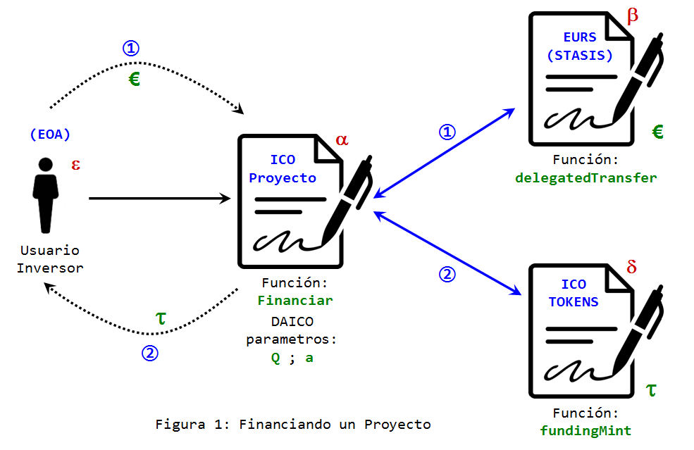
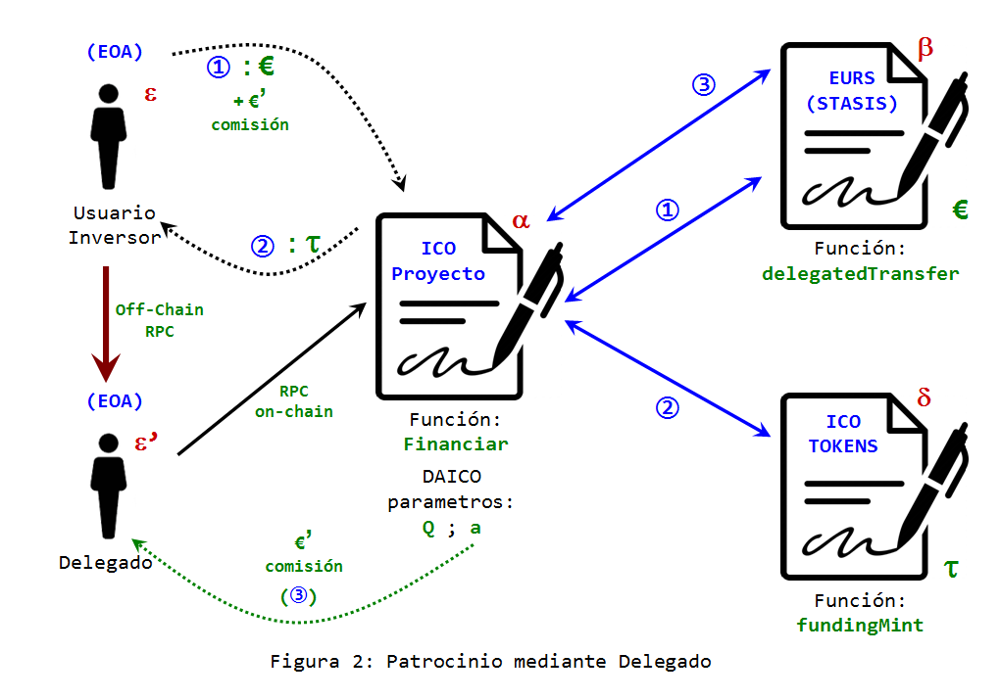

## Un Análisis Sobre la Función "_delegatedTransfer_" y sus Ventajas Sobre el uso de la Función Estándar "_approve_"

Una función con la estrategia de hacer transferencia de fondos con delegación por medio de firmas, como una posibilidad y una buena idea, ha existido desde [hace algún tiempo](https://hackernoon.com/you-dont-need-ether-to-transfer-tokens-f3ae373606e1). Pero con respecto a las **_monedas estables_**, el primer equipo que noté que implementó tal idea en la producción (en la mainnet) es [STASIS-EURS](https://stasis.net/). Veamos qué usos prácticos puede tener esta nueva herramienta.

**La Innovación de la Función _delegatedTransfer_**: Muchas veces la innovación consiste en cambios sencillos que no se habían tomado en serio con anterioridad, pero cuando se implementan, destacan cuan relevantes son para la adopción de una tecnología.

Si la intención de usar monedas estables, es una adopción que de algún modo irrumpa la barrera del efecto de red, necesitamos que el usuario final pueda utilizar esta tecnología sin requerir de él conocimientos avanzados en lo que está sucediendo dentro de su aplicación. Y una de esas barreras es la necesidad de pagar comisiones de *gasolina* en moneda ethereum, para poder movilizar fondos que existen en otra moneda totalmente diferente: euros y dólares!

¿Como le explicamos al ciudadano común que ésos dólares que desea enviar, no se moverán de su cartera a no ser que adquiera y coloque en su misma "*address*" una cantidad suficiente de *ethers*? Es decir, no bastó toda la travesía de adquirir los *Tokens* en moneda estable (ya sean dólares o euros), además debe hacer otra compleja tramitación para adquirir una criptomoneda, que en principio ni le interesa o no le tiene porque interesar para nada. Y todo esto para comprar una revista, un café o pagar su factura de electricidad.

Este es el aporte tecnológico de la función **_delegatedTransfer_** cuya misión es evitarle al usuario final la necesidad de lidiar con una criptomoneda, cuando su campo de acción se concentra en una moneda diferente. El equipo de STASIS desarrollo una aplicación, disponible tanto para móviles con sistema operativo [**_Android_**](https://play.google.com/store/apps/details?id=com.stasis.stasiswallet), como móviles [**_iOS_**](https://apps.apple.com/app/stasis-wallet/id1371949230) que le permiten al usuario enviar a un *delegado* una solicitud de movilización de fondos, mediante comunicación cliente-servidor totalmente discriminada de la blockchain (una llamada RPC off-chain), para poder llevar a cabo los movimientos del EURS-token. Esta solicitud viene acompañada de una firma criptográfica [ECDSA](https://en.wikipedia.org/wiki/Elliptic_Curve_Digital_Signature_Algorithm) bajo el [estándar Ethereum](https://ethereum.stackexchange.com/questions/64380/understanding-ethereum-signatures) que comprende tres parámetros: dos cadenas de 32 bytes llamadas "*R*" y "*S*" y un número de un byte de extensión, o parámetro "*V*".<br><br>

**i.- Cómo funciona _delegatedTransfer_**. El código solidity de esta función es:

```solidity

function delegatedTransfer (
    address _to, uint256 _value, uint256 _fee,
    uint256 _nonce, uint8 _v, bytes32 _r, bytes32 _s)
  public delegatable payable returns (bool) {
    if (frozen) return false;
    else {
      address _from = ecrecover (
        keccak256 (
          thisAddress (), messageSenderAddress (), _to, _value, _fee, _nonce),
        _v, _r, _s);

      if (_nonce != nonces [_from]) return false;

      if (
        (addressFlags [_from] | addressFlags [_to]) & BLACK_LIST_FLAG ==
        BLACK_LIST_FLAG)
        return false;

      uint256 fee =
        (addressFlags [_from] | addressFlags [_to]) & ZERO_FEE_FLAG == ZERO_FEE_FLAG ?
          0 :
          calculateFee (_value);

      uint256 balance = accounts [_from];
      if (_value > balance) return false;
      balance = safeSub (balance, _value);
      if (fee > balance) return false;
      balance = safeSub (balance, fee);
      if (_fee > balance) return false;
      balance = safeSub (balance, _fee);

      nonces [_from] = _nonce + 1;

      accounts [_from] = balance;
      accounts [_to] = safeAdd (accounts [_to], _value);
      accounts [feeCollector] = safeAdd (accounts [feeCollector], fee);
      accounts [msg.sender] = safeAdd (accounts [msg.sender], _fee);

      Transfer (_from, _to, _value);
      Transfer (_from, feeCollector, fee);
      Transfer (_from, msg.sender, _fee);

      return true;
    }
  }

```

La función toma siete (7) parámetros, de los cuales sólo cuatro (4) de ellos son variables del entorno del contrato y las otras tres (3) constituyen simplemente la firma ECDSA, con los parámetros v (uint8), r (bytes32) y s (bytes32). Las cuatro primeras variables son:

 **\_to** (tipo de variable: **_address_**): Es la dirección hacia donde serán transferidos los fondos.<br>
 **\_value** (**_uint256_**): Cantidad de fondos a ser transferidos.<br>
 **\_fee** (**_uint256_**): Comisión a ser pagada al "*delegado*".<br>
 **\_nonce** (**_uint256_**): Numero criptográfico de uso único. <br>
El nonce es un elemento de seguridad que requieren las firmas ECDSA para prevenir ataques de falsificación. Para este fin el contrato que implementa **_delegatedTransfer_** debe también implementar un mapa que lleva la cuenta de los nonces internos para las addresses que utilizan el contrato. En el caso de EURSToken, este mapa es una variable interna (**_nonces_**) pero es consultable públicamente mediante la función:
 
 ```solidity
 
 function nonce (address _owner) public view delegatable returns (uint256) {
    return nonces [_owner];
  }
 
 ```
 
Finalmente, lo que hace **_delegatedTransfer_** es verificar cuantos fondos posee el signatario del mensaje (la address que originó la firma v,r,s) y confirmar que el nonce aprobado por la firma corresponde con el nonce interno del contrato. En el caso de EURSToken, se verifican otras condiciones propias de ése contrato, como chequear que el signatario no está en ninguna "*lista negra*" de prevención al lavado de capitales o si el contrato no esta pausado.

Si todo está en orden, se procede con las respectivas transferencias de fondos. La cantidad **_\_value_** se le acredita a la cuenta **_\_to_** y la cantidad **_\_fee_** se le acredita a **_msg.sender_** quien quiera que sea, y que perfectamente puede ser un contrato o una cuenta externamente controlada (EOA). Al signatario se le actualiza su saldo con las deducciones de **_\_value_** y **_\_fee_**.


**ii.- Porque la función "*approve*" Tiene Desventajas Respecto a _delegatedTransfer_**. De acuerdo al [estándar ERC20](https://github.com/ethereum/EIPs/blob/master/EIPS/eip-20.md) la [configuración recomendada](https://github.com/OpenZeppelin/openzeppelin-contracts/blob/master/contracts/token/ERC20/ERC20.sol) para la función **_approve_** es:

```solidity

function approve(address spender, uint256 amount) public returns (bool) {
        _approve(_msgSender(), spender, amount);
        return true;
    }

```

donde 

```solidity

function _approve(address owner, address spender, uint256 amount) internal {
        require(owner != address(0), "ERC20: approve from the zero address");
        require(spender != address(0), "ERC20: approve to the zero address");

        _allowances[owner][spender] = amount;
        emit Approval(owner, spender, amount);
    }

```

por otro lado, *\_allowances* es un mapa que registra autorizaciones o delegaciones de fondos:

```solidity
mapping (address => mapping (address => uint256)) private _allowances;
```

y \_msgSender() es una función que identifica quién esta invocando al contrato:

```solidity

    function _msgSender() internal view returns (address payable) {
        return msg.sender;
    }

```

Lo que en pocas palabras significa que **_approve_** modifica el mapa *\_allowances* asumiendo como dueño de los fondos únicamente a la dirección **_msg.sender_**, es decir, el ente o elemento que hace **_directamente_** la llamada al contrato que maneja los tokens ERC20.

No hay manera de delegar el manejo de fondos a través de un contrato que intermedie en esa transacción; tiene que ser *directamente* el dueño de estos fondos. Adicionalmente, la invocación de approve que necesariamente debe realizarse mediante una transacción es sólo la mitad de la historia: una vez que la cuenta **_spender_** ha sido autorizada, ésta debe efectuar la invocación a la función **_transferFrom_** para en efecto hacer uso (cualquiera que sea) de los fondos; por seguridad, la configuración de esta acción debe requerir que el único que la invoca es (de nuevo) el mismo dueño de los fondos, sin posibilidad de delegarla. Y esto debe realizarse en otra transacción aparte, lo cual obliga al interesado costear dos veces el monto mínimo de gasolina que exige una transacción (21.000 unidades de Gas). Además, la espera para completar todo el proceso es la confirmación de dos (2) en lugar de una sola transacción.

Aparte de [otras complicaciones](https://blog.smartdec.net/erc20-approve-issue-in-simple-words-a41aaf47bca6) que pueden surgir debido a esta función, **_approve_** ya complica la incorporación de una aplicación para usuarios en general, que no necesitan enterarse de las capas internas de la tecnología que usan.

A diferencia de esto, **_delegatedTransfer_** es una función segura de delegación de fondos y al mismo tiempo una asignación efectiva de fondos hacia cualquier entidad (sea contrato o cuenta normal), y por ende puede ser invocada desde un contrato, a través de funciones que pueden invocar otras funciones, de cualquier otra cantidad de contratos que se necesiten **_en una sola transacción_**. Lo que hace posible que el usuario final, ni siquiera tenga que lidiar con la compra de una *criptomoneda* llamada Ethereum y adicionalmente lo que convierte potencialmente a la función **_delegatedTransfer_** en un sustituto idóneo para *approve* y *transferFrom*, dejando obsoletas estas funciones en el estándar ERC20.

**iii.- ¿En Qué Casos Resulta Útil la Función _delegatedTransfer_?**. Numerosos son los casos y circunstancias en que cualquier activo representado por un tóken ERC20 puede ser utilizado provechosamente mediante esta función. Pero en este corto análisis me quiero referir a tres casos importantes en que una moneda estable puede recibir un gran provecho:

 - **N° 1**: **Recolección de fondos (o "_crowdfundings_") para proyectos e ICOS**. Dada la naturaleza de la moneda estable, una meta en tiempo y cifra mínima de activos, se corresponde a la perfección con los objetivos de un proyecto, ya que los costos de ejecución estarán atados a una cierta moneda de curso legal, y generalmente en dólares, euros u otras monedas representativas de la economía internacional, estos costos no se espera verlos variar significativamente en largos períodos de tiempo. Se busca que el usuario promedio no necesite de una formación especialmente detallada sobre la cadena de bloques ni su tecnología, y una aplicación que le permita invertir a este usuario en un proyecto, sin tener que preocuparse por tales detalles podría representar una ventaja insospechada.<br><br>
 - **N° 2**: **Anonimización u Ofuscación de la Propiedad de los Fondos mediante _Mixers_, tales como [Tornado-Cash](https://github.com/tornadocash/tornado-core)**. Si se espera que una adopción especialmente numerosa empiece a suceder en torno a las monedas estables, se hace urgentemente necesario, proteger la identidad de aquellos usuarios que adquieren los tókens bien sea mediante intermediarios, proveedores de liquidez o de manera mas directa con la empresa o institución que los acuña; ya que al ser pública la cadena de bloques, la posibilidad de identificar una address con una persona y su ubicación, no es conveniente por razones obvias y por lo que puede suceder, especialmente si en esa address se encuentren alojadas altas cifras de dinero. No obstante dependerá de cada institución proveedora del tóken en cuestión, ya que la mayoría de las monedas estables a su vez están sujetas a las mismas regulaciones estrictas de la banca que respalda esos tokens con activos y fondos de inversión. La única moneda estable que no sufre este tipo de censura y que a su vez ya posee un mecanismo de aprobación delegada de fondos mediante firmas ECDSA, es la [nueva](https://migrate.makerdao.com/) DAI Multi-Colaterales, o simplemente [DAI](https://etherscan.io/address/0x6b175474e89094c44da98b954eedeac495271d0f#code); no obstante esta nueva moneda no prevee en la arquitectura de su contrato, un mecanismo de actualizaciones. Y lamentablemente, la función de aprobación delegada de DAI, "**_permit_**" no deja definir cantidades parciales de fondos, ni comisiones al relayer o delegado en su algoritmo.<br><br>
 - **N° 3**: **Depósitos en Garantía no Custodiados o "_Escrows_"**. Finalmente, un uso del cual sacaría exelente provecho el mercado en cualquier ramo de actividad comercial sería la posibilidad de colocar en un depósito no custodiado, el pago por cualquier concepto de compra o intercambio, y permitir que cualquier disputa sea resuelta por un determinado agente o agentes de confianza o si el estado del arte lo permite en un futuro próximo, un oráculo totalmente desconfiable.<br><br>

**iv.- Estrategias de Programación para Aprovechar cada Caso de Uso**. A continuación vamos a revisar a nivel de código como pueden programarse las funciones que permitan a un contrato inteligente aprovechar las bondades de **_delegatedTransfer_**.

#### Caso N° 1: Financiando un **_[ICO](https://en.wikipedia.org/wiki/Initial_coin_offering)_**

Proveer fondos para una campaña de colecta para la promoción de un proyecto, puede realizarse mediante monedas estables a través de la mediación de un contrato. Este contrato que llamaremos el "ICO proyecto", puede ejecutar una serie de promesas, al momento (es decir, en la misma transacción) de recibirse los fondos de un cierto financiamiento, de un modo simple para el usuario y abaratando costos de transacción. (El mecanismo estándar de `approve` + `transferFrom`, utilizado comúnmente en Dapps, como [Compound.Finance](https://app.compound.finance/) o [1inch.exchange](https://1inch.exchange/#/), requiere de la aprobación directa de dos transacciones y el manejo de ethers por parte del usuario, es decir: "sólo para expertos").

Vamos a suponer para este caso, una sencilla promesa: la de emitir una cierta cantidad de tókens ERC20 a favor del usuario inversionista, los que llamaremos los "ICO-Tókens". Estos tókens estarán relacionados con el proyecto que la colecta pretende financiar, y perfectamente el ICO proyecto y el contrato ERC20 de los ICO-Tókens, pueden ser un solo contrato inteligente, pero para mantener las cosas simples en esta explicación los supondremos por separado.

Ahora vamos a suponer, que los fondos que se van a aceptar para financiar este proyecto, son euros digitales o los "**_[EURS-Tókens](https://etherscan.io/address/0xdb25f211ab05b1c97d595516f45794528a807ad8#code)_**", provenientes del contrato que llamaremos "EURS (STASIS)":



En la figura 1 se han indicado las direcciones o addresses tanto de usuario(s) como de los contratos, con letras griegas. Por ejemplo el ICO proyecto tiene dirección **&#945;**. La address del usuario (una EOA): **&#949;**, para EURS (STASIS): **&#946;** y la del ERC20 que provee los ICO-Tókens: **&#948;**. Asi mismo se indica como símbolo del tóken del proyecto, la letra **&#964;**.

El usuario **&#949;** hace una llamada al ICO proyecto **&#945;**, mediante la función hipotética "**_Financiar_**". Esta función debe pedir como argumentos la firma (los tres elementos r, s y v) del usuario autorizando la movilización de sus euros digitales, manejados por **&#946;**, la cual debe calcularse en un proceso privado, como una calculadora o una aplicación local. También debe pedir como argumento la cantidad de fondos en euros que el usuario pretende aportar como patrocinio al proyecto. Esto le dice a **&#946;** el parámetro "_\_value_".

Otro dato que, por simplicidad supondremos que provee el usuario o la interfaz del usuario, es el número "**_nonce_**" interno que tiene asociada su address **&#949;** en el contrato **&#946;**. En realidad el ICO proyecto puede consultar perfectamente este dato, haciendo una invocación en el contrato **&#946;** de la función "nonce(**&#949;**)". Pero esto tendría un costo en gasolina adicional, lo cual por otro lado resulta gratis al usuario si hace la consulta mediante la interfaz, ya que se trata de una función "*public view*".

No obstante quedan otros dos datos a indicarle a **&#946;**: la address _\_to_ y el valor numerico _\_fee_. Dado que no estamos asumiendo la necesidad de un delegado, el contrato mismo puede asumir un valor nulo para _\_fee_ y el valor _\_to_ ya lo conoce **&#945;**: es su propia dirección **&#945;**, que en solidty puede invocarse mediante el comando "`this`".

De este modo la función **_Financiar_** hace una llamada a **&#946;** invocando a la función **_delegatedTransfer_** con todos los parámetros que necesita para ejecutar la transferencia de "_\_value_" euros, desde el usuario hasta el ICO proyecto (indicado como "1" en la figura). El segundo paso de la función **_Financiar_**, tras confirmar que la anterior llamada fue exitosa (devolviendo "verdadero"), es invocar a la función hipotética (puede llamarse de cualquier otro modo) "**_fundingMint_**" del contrato **&#948;**.

Esta llamada ordena emitir una suma de "_\_value_" tókens **&#964;** a favor de la address **&#949;** (indicado como "2" en la figura). Esto se puede lograr previendo el recurso de un mapeo o variable "mappings" propio del contrato del ICO-Tóken, en donde se autorizan a determinados contratos a dar ordenes de acuñación al referido contrato ICO-Tóken. 

Algo como: `mapping (address => bool) internal autorizados;` que le diga a **&#948;** que "autorizados(**&#945;**) = true", y que si se le ordena desde este "**_msg.sender_** == **&#945;**" emitir (_mint_) una cantidad de "_\_value_" tokens (**&#964;**) a favor de cierto usuario, entonces esta orden puede efectuarse sin problema.

Pero surge la incógnita de quién puede tener autoridad para indicarle al ICO-Tóken que cierta address **&#945;** puede arrojar o no "verdadero" en el mapa "autorizados". Si asumimos que el proyecto ICO será manejado por un sistema de gobernanza distribuida como lo sugiere el modelo de los **_[DAICO's](https://ethresear.ch/t/explanation-of-daicos/465)_**, entonces el ICO proyecto puede tener unos parámetros con valores iniciales, que a partir del momento que se reciba una cantidad minima de financiamiento, los patrocinadores que han financiado el proyecto empiezan a controlar, y pueden hacerlo mediante un contrato de gobernanza no indicado en la figura.

Estas variables, como se indica en la figura 1 son la dirección del administrador del contrato "_a_" y el caudal de fondos que este administrador estará autorizado a retirar semanalmente, es decir "_Q_". Si a los patrocinadores no les gusta como este administrador está dirigiendo el proyecto, pueden por votación setear de regreso a _Q_ al valor cero y rescatar los fondos que aún queden en el ICO proyecto.

Otra de las cosas que se podrían decidir, sería la admisión de nuevos patrocinadores o de mas fondos para el proyecto, como parte de una interminable lista de desiciones que los patrocinadores podrian tomar.

Finalmente, en código solidity, la función **_Financiar_**, podría tener la sigiente forma:

```solidity

function Financiar (uint8 _v, bytes32 _r, bytes32 _s, uint256 _value, uint256 _nonce) external returns (bool) {
    
    // Llamada o paso Nro "1" :
    
    (bool success, bytes memory data) = 
    EURS.call(abi.encodeWithSelector(0x8c2f634a /* delegatedTransfer */, 
    address(this), _value, 0, _nonce, _v, _r, _s));
    require(success, "saldo insuficiente");
        
    // el contrato debe retornar verdadero.
    if (data.length > 0) {
      require(data.length == 32, "la extencion de datos debe ser 0 o 32 bytes");
      success = abi.decode(data, (bool));
      require(success, "problemas de delegacion. el contrato retorno falso.");
    }
    
    // Llamada o paso Nro "2" :
    
    (success, data) = 
    ICO_Token.call(abi.encodeWithSelector(0x1354714a /* fundingMint */, _value, address(msg.sender)));
    require(success, "problemas de autorizacion");
        
    // el contrato debe retornar verdadero.
    if (data.length > 0) {
      require(data.length == 32, "la extencion de datos debe ser 0 o 32 bytes");
      success = abi.decode(data, (bool));
      require(success, "el contrato retorno falso.");
    }

    emit Inversion(address(msg.sender), _value);
    
    return true;
         
    }

```

En donde el constructor define las direcciones de los contratos EURS (**&#946;**) e ICO_Token (**&#948;**) con los que el ICO proyecto (**&#945;**) se va a coimunicar:

```solidity

    address public EURS;
    address public ICO_Token;
    event Inversion(address _investor, uint256 _cantidad);
    
    constructor (address EURStoken, address ICO) public {
        
        EURS        = EURStoken;
        ICO_Token   = ICO;
        
    }
```

Una breve explicación de lo que hace esta función, es simplemente que ocurren dos llamadas a dos contratos diferentes para ejecutar dos funciones en una sola transacción. Y en este caso se efectuan estas llamadas mediante el comando [`<address>.call(bytes memory)`](https://solidity.readthedocs.io/en/v0.5.3/units-and-global-variables.html?#members-of-address-types). Esta poderosa instrucción ejecuta el comando de bajo nivel `CALL` en la máquina virtual de ethereum. Como argumentos esta función toma un tren de datos, denomindao "payload" de la memoria y como resultado devuelve dos parámetros: `(bool, bytes memory)`. Un valor booleano indicando si la llamada tuvo o no éxito y otro tren de datos; la respuesta que la función que acabamos de invocar nos ha devuelto del contrato externo hacia la memoria.

En el caso de `<address>.call(payload)` los datos a suministrar, deben estar codificados de manera que puedan ser leídos por la máquina virtual. Sin embargo los datos pueden ingresar en un formato legible de alto nivel y codificarse mediante un paquete de métodos de solisity llamado "ABI-encoding functions". Y allí entra en escena el método [`abi.encodeWithSelector`](https://solidity.readthedocs.io/en/v0.5.3/units-and-global-variables.html?#abi-encoding-and-decoding-functions), que recoge como argumentos el encabezado o identificador de la función que invocaremos del contrato ubicado en la address `<address>` y los tipos de variable que toma esta función.

El codigo de la función, que en el caso de **_delegatedTransfer_** es `0x8c2f634a` puede generarse mediante las utilerías del paquete web3, pero que fácilmente puede calcularse utilizando la cónsola de [remix](https://remix.ethereum.org), al colocar la instrucción:

```cmd
>web3.eth.abi.encodeFunctionSignature('delegatedTransfer(address, uint256, uint256, uint256, uint8, bytes32, bytes32)')
```

Evitando dejar espacios, excepto entre la designación de los tipos de variables de la función. Y en el caso de la función **_fundingMint_**, el código `0x1354714a` se obtiene con el comando:

```cmd
>web3.eth.abi.encodeFunctionSignature('fundingMint(uint256, address)')
```

Esto ultimo merece una explicación: ¿Qué forma ha de tomar `fundingMint`? Para ello se sugiere el siguiente codigo en solidity, una escueta representación del contrato del ICO-Tóken:

```solidity

pragma solidity ^0.5.16;

import "./ERC20_tipico.sol";

contract Token is ERC20 {
    
    uint256 public totalSupply;
    mapping (address => uint)  public balanceOf;
    
    
    mapping (address => bool) internal autorizados;
    event Autorizado (address _contrato, bool _inclusion);
    address internal Admin;     // administrador del contrato
    event Transfer(address _desde, address _hacia, uint _cuanto);
    
    constructor() public {
        
        Admin = msg.sender;
        
    }
    
    modifier soloAdmin {
        
        require (msg.sender == Admin);
        _;
        
    }
    
    modifier soloAuto {
        
        require (autorizados[msg.sender]);
        _;
        
    }
    
    function autorizar (address _a, bool _w) public soloAdmin returns (bool) {
        
        autorizados[_a] = _w;
        emit Autorizado(_a, _w);
        return true;
        
    }
    
    function fundingMint (uint256 _value, address _investor) public soloAuto returns (bool) {
        
        balanceOf[_investor] += _value;
        totalSupply          += _value;
        emit Transfer(address(0), _investor, _value);
 
      return true;
       
    }

}

```

En donde por comodidad y brevedad, se da a entender que el archivo `ERC20_tipico.sol` contiene una descripción del contrato "ERC20" y todas sus especificaciones estándar.

En el contrato anterior (`Token`), se ha declarado el mapeo que autoriza direcciones de contratos para acuñar tókens. Se hace referencia al administrador del contrato y a los eventos de autorización y transferencia. La función **_fundingMint_** viene con el modificador `soloAuto` para restringir el acceso solo a las ordenes que nacen de las llamadas de contratos autorizados: `autorizados[msg.sender]`.

Como comentario final para este punto abordaremos los cambios que requeriría la función **_Financiar_** si se acepta a un delegado como mediador para que el inversionista no tenga que "ensuciarse las manos" con el tema de la gasolina.



En la figura 2, se observa que ahora la función **_Financiar_** debe hacer 3 llamadas: debe ordenar la transferencia delegada de fondos (indicada como "1") llamando al contrato **&#946;**, pero en esta invocación, incidentalmente al contrato **&#945;** le van a entregar la comisión de la transacción. El usuario inversionista (**&#949;**) esta por ende transfiriendo a **&#945;** en total _\_value_ + _\_fee_.

Esto sucede porque la función **_delegatedTransfer_** está configurada para enviar el importe de _\_fee_ monedas al "**_msg.sender_**", que en este caso es el contrato **&#945;**.

Luego, **_Financiar_** hace su llamada a **&#948;** contra la función **_fundingMint_** para acuñar los tokens a favor del inversionista (indicado como "2") y finalmente le transfiere al delegado su comisión mediante otra llamada al contrato **&#946;** contra la función **_transfer_** (indicado como "3"), lo cual puede ahora hacer el contrato sin problema, pues ya las monedas están en su poder.

Pero hay unos detalles inconclusos que deberán incorporarse al codigo solidity de la función **_Financiar_**, para dar cabida a un delegado: ahora, se debe hacer una deducción de quién es el usuario inversionista para hacerle el envío de los tókens **&#964;**, ya que el "**_msg.sender_**" que llama al ICO proyecto, es ahora el delegado. Esto puede hacerse añadiendo al comienzo de la función la instrucción:

```solidity
Signatario = ecrecover(keccak256 ((abi.encodePacked( address(EURS), address(this), address(this), _value, _fee, _nonce))), v, r, s);
```

Para recuperar cual es la address **&#949;** de quien ha generado la firma (v, r, s).

Adicionalmente debe admitirse en los argumentos a _\_fee_:

```solidity
function Financiar (uint8 _v, bytes32 _r, bytes32 _s, uint256 _value, uint256 _nonce, uint256 _fee) external returns (bool) {

}
```

Tras hacer los últimos arreglos pertinentes, la función **_Financiar_** queda del siguiente modo:

```solidity

function Financiar (uint8 _v, bytes32 _r, bytes32 _s, uint256 _value, uint256 _nonce, uint256 _fee) external returns (bool) {
    
    address Signatario = ecrecover(keccak256 ((abi.encodePacked( address(EURS), address(this), address(this), _value, _fee, _nonce))), v, r, s);
    
    // Llamada o paso Nro "1" :
    
    (bool success, bytes memory data) = 
    EURS.call(abi.encodeWithSelector(0x8c2f634a /* delegatedTransfer */, 
    address(this), _value, _fee, _nonce, _v, _r, _s));
    require(success, "saldo insuficiente");
        
    // el contrato debe retornar verdadero.
    if (data.length > 0) {
      require(data.length == 32, "la extencion de datos debe ser 0 o 32 bytes");
      success = abi.decode(data, (bool));
      require(success, "problemas de delegacion. el contrato retorno falso.");
    }
    
    // Llamada o paso Nro "2" :
    
    (success, data) = 
    ICO_Token.call(abi.encodeWithSelector(0x1354714a /* fundingMint */, _value, Signatario));
    require(success, "problemas de autorizacion");
        
    // el contrato debe retornar verdadero.
    if (data.length > 0) {
      require(data.length == 32, "la extencion de datos debe ser 0 o 32 bytes");
      success = abi.decode(data, (bool));
      require(success, "el contrato retorno falso.");
    }
    
    // Llamada o paso Nro "3"
    
    (success, data) = 
    EURS.call(abi.encodeWithSelector(0xa9059cbb /* transfer */, address(msg.sender), _fee));
    require(success, "problema desconocido");
        
    // el contrato debe retornar verdadero.
    if (data.length > 0) {
      require(data.length == 32, "la extencion de datos debe ser 0 o 32 bytes");
      success = abi.decode(data, (bool));
      require(success, "el contrato retorno falso.");
    }

    emit Inversion(Signatario, _value);
    
    return true;
         
    }

```

#### Caso N° 2: Ofuscando Fondos con Mezcladores como **_[Tornado Cash](https://github.com/tornadocash/tornado-core)_**

El objetivo de un mezclador es ayudar a que los usuarios que movilizan fondos en la cadena de bloques, puedan difuminar cualquier rastro que pueda dar con su identidad, pues dada la naturaleza pública de esta plataforma, entre más fondos se movilizan, mayores son los riesgos de ser victimas de múltiples tipos de ataques. Sin embargo, la mayoría de las monedas estables, operan respaldando el valor de sus tokens mediante activos resguardados en cuentas fiduciarias o de custodia en el sistema bancario; por ende, estas monedas están tambien sujetas a las mismas regulaciones bancarias, las cuales no ven con buenos ojos a un titular de fondos especialmente sustanciosos, con la intención de proteger u ocultar su identidad. Es por ello que la mejor opción está en la anonimización de la moneda estable Dai, que no está sujeta a este tipo de censura.

En la actualidad el servicio de mezcla de fondos más evoluicionado, es el que ha desarrollado el equipo de [Tornado Cash](https://tornado.cash/). Para comprender los detalles profundos de como opera internamente un mezclador mediante el paradigma [ZK-SNARK](https://z.cash/technology/zksnarks/), es recomendable visitar las referencias que estos desarrolladores han publicado. Lo relevante en este analisis es comprender que un mezclador es un contrato, una especie de caja de depósito de fondos **_sin custodia_** (es decir, los fondos no están en *manos* de nadie), donde cada usuario hace un deposito por cantidades predefinidas, iguales (para que sea posible ofuscar la titularidad de tales fondos), y mediante la presentación de una prueba de conocimiento nulo, hacer el retiro a favor de una cuenta virgen, sin historial que pueda rastrearse; es decir, cada usuario presenta una prueba de ser en efecto uno de los depositantes del mezclador y que sólo intenta retirar los fondos que corresponden a **_su_** depósito por una única vez, y **_sin revelar detalles de quien se trata_**.

La magia de las matemáticas detrás de esta hazaña se dejan para las multiples referencias de este tema, [extremadamente extenso](https://medium.com/@VitalikButerin/zk-snarks-under-the-hood-b33151a013f6). A continuación veremos como puede mejorarse la experiencia del usuario que desea anonimizar la titularidad de su dinero, sin tener que adentrarase mucho en el conocimiento de la cadena de bloques, que es lo idóneo para fomentar un uso masivo de esta tecnología.

Dado que la idea es comparar las ventajas de la función **_delegatedTransfer_**, veremos cómo se mejoraría el código con un mezclador para la moneda **_[EURS-Token](https://coinmarketcap.com/currencies/stasis-euro/)_**, y luego con la nueva version de la moneda **_[Dai](https://coinmarketcap.com/currencies/multi-collateral-dai/)_**, usando la función **_permit_**.

En primer lugar, los contratos de Tornado Cash, admiten una función de depósito que utiliza un solo argumento de entrada. Este argumento, llamado **_compromiso_**, es la imagen criptografica del secreto que identifica a cada depósito, el cual nunca es revelado y que permite generar la prueba de que en efecto se intenta retirar legítimamente y por vez única los fondos que corresponden al referido depósito vinculado a ese secreto.

El código de esta función de depósito es:

```solidity

function deposit(bytes32 _commitment) external payable nonReentrant {
    require(!commitments[_commitment], "The commitment has been submitted");

    uint32 insertedIndex = _insert(_commitment);
    commitments[_commitment] = true;
    _processDeposit();

    emit Deposit(_commitment, insertedIndex, block.timestamp);
  }

```

En el anterior código, **[_nonReentrant_](https://github.com/OpenZeppelin/openzeppelin-contracts/blob/master/contracts/utils/ReentrancyGuard.sol)** es un modificador que sirve de mecanismo de seguridad para evitar ataques de retiros múltiples y que escencialmente utiliza un banderín que se guarda en la memoria de estado del contrato (o *storage*) que le dice al contrato que si se intenta retirar mas de una vez, que el camino está bloqueado.

A continuación el contrato verifica que el compromiso presentado sea único: y debe serlo, por el modo en que se genera la pre-imagen o secreto, llamado **_nulificador_** y que es similar a una llave privada, con probabilidades astronómicamente bajas de colisión. A continuación el compromiso se incorpora a la base de datos del contrato, lo cual se logra mediante un [árbol de Merkle](https://blog.ethereum.org/2015/11/15/merkling-in-ethereum/), y se ejecuta el depósito de los fondos, mediante la función interna **_\_processDeposit()_** la cual consiste en:

```solidity

  function _processDeposit() internal {
    require(msg.value == 0, "ETH value is supposed to be 0 for ERC20 instance");
    _safeErc20TransferFrom(msg.sender, address(this), denomination);
  }

```

En donde la denominación (*denomination*) es el monto fijo y uniforme de depósitos que hace cada usuario y la función **_\_safeErc20TransferFrom_** es:

```solidity

  function _safeErc20TransferFrom(address _from, address _to, uint256 _amount) internal {
    (bool success, bytes memory data) = token.call(abi.encodeWithSelector(0x23b872dd /* transferFrom */, _from, _to, _amount));
    require(success, "not enough allowed tokens");

    // if contract returns some data lets make sure that is `true` according to standard
    if (data.length > 0) {
      require(data.length == 32, "data length should be either 0 or 32 bytes");
      success = abi.decode(data, (bool));
      require(success, "not enough allowed tokens. Token returns false.");
    }
  }
```

Sin embargo, para poder llevar a cabo esta operación, el usuario previamente y de manera directa debe haber efectuado contra el contrato referido en la variable `token` una transacción invocando la función estandar **_approve_**, que es lo que en principio desea evitarse. 

Una posible mejora a este tipo de contratos sería la inclusión de otra función de depósitos: **_directDeposit_**, que incluye la admisión de los argumentos de la firma y las comisiones de un delegado:

```solidity

function directDeposit(bytes32 _commitment, uint256 _FEE, uint256 _N, uint8 _V, bytes32 _R, bytes32 _S) 
external payable nonReentrant {
    require(!commitments[_commitment], "The commitment has been submitted");

    uint32 insertedIndex = _insert(_commitment);
    commitments[_commitment] = true;
    _processDirectDeposit(_FEE, _N, _V, _R, _S);

    emit Deposit(_commitment, insertedIndex, block.timestamp);
  }

```

En la cual se incorpora el cambio por la función interna **_\_processDirectDeposit_**:

```solidity

function _processDirectDeposit(uint256 _fee, uint256 _nonce, uint8 _v, bytes32 _r, bytes32 _s) internal {
    require(msg.value == 0, "ETH value is supposed to be 0 for ERC20 instance");
    _safeErc20TransferDirect(msg.sender, address(this), denomination, _fee, _nonce, _v, _r, _s);
  }

```

Y finalmente la inclusión de **_\_safeErc20TransferDirect_**, utilizando el recurso de **_delegatedTransfer_** del EURS-Token:

```solidity

function _safeErc20TransferDirect(address _relayer, address _to, uint256 _amount, uint256 fee, uint256 nonce, uint8 v, bytes32 r, bytes32 s) internal {

// primera etapa, aceptar los fondos:

    (bool success, bytes memory data) = 
    EURS.call(abi.encodeWithSelector(0x8c2f634a /* delegatedTransfer */, _to, _amount, fee, nonce, v, r, s));
    require(success, "saldo insuficiente");
    
    // verificar que la data recibida sea `verdadero` 
    if (data.length > 0) {
      require(data.length == 32, "la extension de datos debe ser 0 o 32 bytes");
      success = abi.decode(data, (bool));
      require(success, "problemas de firma. EURS devuelve falso.");
    }

// segunda etapa, transferir comisiones al delegado:

     (success, data) = 
    EURS.call(abi.encodeWithSelector(0xa9059cbb /* transfer */, _relayer, fee));
    require(success, "problema desconocido");
        
    // el contrato debe retornar verdadero.
    if (data.length > 0) {
      require(data.length == 32, "la extencion de datos debe ser 0 o 32 bytes");
      success = abi.decode(data, (bool));
      require(success, "el contrato retorno falso.");
    }

}

```

En donde EURS es la variable que hace referencia al contrato de EURS-Token: `0xdB25f211AB05b1c97D595516F45794528a807ad8`.

Con una ligera carga adicional, esto mismo puede realizarse para el contrato Dai: `0x6B175474E89094C44Da98b954EedeAC495271d0F`, mediante la función **_permit_**, cuyo contenido es:

```solidity

function permit(address holder, address spender, uint256 nonce, uint256 expiry, bool allowed, uint8 v, bytes32 r, bytes32 s) external
    {
        bytes32 digest =
            keccak256(abi.encodePacked(
                "\x19\x01",
                DOMAIN_SEPARATOR,
                keccak256(abi.encode(PERMIT_TYPEHASH,
                                     holder,
                                     spender,
                                     nonce,
                                     expiry,
                                     allowed))
        ));

        require(holder != address(0), "Dai/invalid-address-0");
        require(holder == ecrecover(digest, v, r, s), "Dai/invalid-permit");
        require(expiry == 0 || now <= expiry, "Dai/permit-expired");
        require(nonce == nonces[holder]++, "Dai/invalid-nonce");
        uint wad = allowed ? uint(-1) : 0;
        allowance[holder][spender] = wad;
        emit Approval(holder, spender, wad);
    }

```

La cual simplemente permite delegar la aprobación de uso delegado de fondos, durante un plazo de tiempo que puede ser indefinido y por una cantidad de fondos que toca el extremo del valor máximo para uint256. Una de las desventajas de **_permit_** es que necesariamente hay que añadir como parte de los argumentos a la dirección del inversionista, ya que al estar referida en la construcción de la firma, este dato no se puede "deducir" tal como si es posible en el estándar de "**_delegatedTransfer_**".

Por ende la función **_directDeposit_** debe ir declarada del siguiente modo:

```solidity
function directDeposit(bytes32 _commitment, address INVESTOR, uint256 _FEE, uint256 _N, uint8 _V, bytes32 _R, bytes32 _S) 
external payable nonReentrant { }
```

La función interna `_processDirectDeposit(INVESTOR, _FEE, _N, _V, _R, _S);` también debe incluir el nuevo parámetro y finalmente para incorporar esta estrategia de depósito delegado con el contrato Dai, se modifica **_\_safeErc20TransferDirect_** invocándola del siguiente modo: `_safeErc20TransferDirect(msg.sender, address(this), denomination, _investor, _fee, _nonce, _v, _r, _s);` y definiendola como sigue:

```solidity

function _safeErc20TransferDirect(address _relayer, address _to, uint256 _amount, address investor, uint256 fee, uint256 nonce, uint8 v, bytes32 r, bytes32 s) internal {

// primera etapa, modificar 'allow':

    (bool success, bytes memory data) = 
    DAI.call(abi.encodeWithSelector(0x80c33b34 /* permit */, investor, _to, nonce, 0 /* para no dejar que el ajuste expire */ , true /* el booleano "allowed" */, v, r, s));
    require(success, "problemas de firma");

    // verificar que la data recibida sea `verdadero` 
    if (data.length > 0) {
      require(data.length == 32, "la extension de datos debe ser 0 o 32 bytes");
      success = abi.decode(data, (bool));
      require(success, "problemas de firma. DAI devuelve falso.");
    }

// segunda etapa, transferir los fondos al mezclador:

(success, data) = DAI.call(abi.encodeWithSelector(0x23b872dd /* transferFrom */, investor, _to, _amount + fee));
    require(success, "saldo insuficiente");

    // verificar que la data recibida sea `verdadero` 
    if (data.length > 0) {
      require(data.length == 32, "la extension de datos debe ser 0 o 32 bytes");
      success = abi.decode(data, (bool));
      require(success, "DAI devuelve falso.");
    }
    
// tercera etapa, transfer comisiones al delegado:

     (success, data) = 
    DAI.call(abi.encodeWithSelector(0xa9059cbb /* transfer */, _relayer, fee));
    require(success, "problema desconocido");
        
    // el contrato debe retornar verdadero.
    if (data.length > 0) {
      require(data.length == 32, "la extencion de datos debe ser 0 o 32 bytes");
      success = abi.decode(data, (bool));
      require(success, "el contrato retorno falso.");
    }

  }

```

#### Caso N° 3: Escrows 

Finalmente el caso de los depósitos en garantía cuando el activo en juego son tókens estándar ERC20, sí que presenta un desafío a la técnica tradicional `approve` + `transferFrom` ya que hay en juego un asunto de confianza. Si se espera diseñar estrategias de comercio altamente independientes de la confianza, es necesario evitar el uso de la función `approve`. 


**iv.- ¿Cómo Generar una Firma (v, r, s)?**. A continuación vamos a revisar a nivel de código como pueden programarse las funciones que permitan a un contrato inteligente aprovechar las bondades de **_delegatedTransfer_**.
