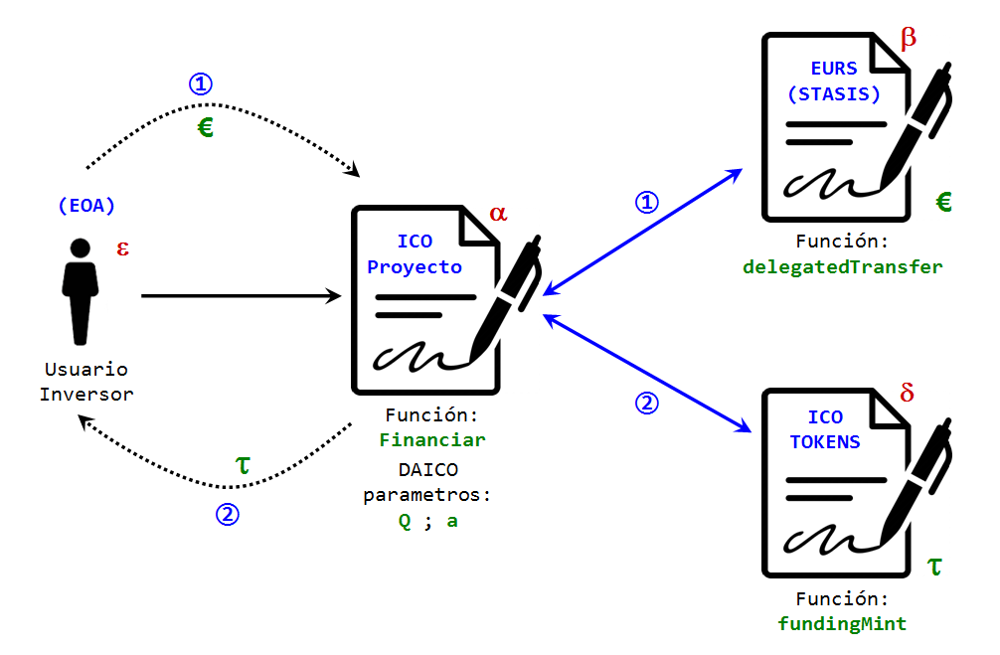

## Un Análisis Sobre la Función "_delegatedTransfer_" y sus Ventajas Sobre el uso de la Función Estándar "_approve_"

Una función con la estrategia de hacer transferencia de fondos con delegación por medio de firmas, como una posibilidad y una buena idea, ha existido desde [hace algún tiempo](https://hackernoon.com/you-dont-need-ether-to-transfer-tokens-f3ae373606e1). Pero con respecto a las **_monedas estables_**, el primer equipo que noté que implementó tal idea en la producción (en la mainnet) es [STASIS-EURS](https://stasis.net/). Veamos qué usos prácticos puede tener esta nueva herramienta.

**La Innovación de la Función _delegatedTransfer_**: Muchas veces la innovación consiste en cambios sencillos que no se habían tomado en serio con anterioridad, pero cuando se implementan, destacan cuan relevantes son para la adopción de una tecnología.

Si la intención de usar monedas estables, es una adopción que de algún modo irrumpa la barrera del efecto de red, necesitamos que el usuario final pueda utilizar esta tecnología sin requerir de él conocimientos avanzados en lo que está sucediendo dentro de su aplicación. Y una de esas barreras es la necesidad de pagar comisiones de *gasolina* en moneda ethereum, para poder movilizar fondos que existen en otra moneda totalmente diferente: euros y dólares!

¿Como le explicamos al ciudadano común que ésos dólares que desea enviar, no se moverán de su cartera a no ser que adquiera y coloque en su misma "*address*" una cantidad suficiente de *ethers*? Es decir, no bastó toda la travesía de adquirir los *Tokens* en moneda estable (ya sean dólares o euros), además debe hacer otra compleja tramitación para adquirir una criptomoneda, que en principio ni le interesa o no le tiene porque interesar para nada. Y todo esto para comprar una revista, un café o pagar su factura de electricidad.

Este es el aporte tecnológico de la función **_delegatedTransfer_** cuya misión es evitarle al usuario final la necesidad de lidiar con una criptomoneda, cuando su campo de acción se concentra en una moneda diferente. El equipo de STASIS desarrollo una aplicación, disponible tanto para móviles con sistema operativo [**_Android_**](https://play.google.com/store/apps/details?id=com.stasis.stasiswallet), como móviles [**_iOS_**](https://apps.apple.com/app/stasis-wallet/id1371949230) que le permiten al usuario enviar a un *delegado* una solicitud de movilización de fondos, mediante comunicación cliente-servidor totalmente discriminada de la blockchain (una llamada RPC off-chain), para poder llevar a cabo los movimientos del EURS-token. Esta solicitud viene acompañada de una firma criptográfica [ECDSA](https://en.wikipedia.org/wiki/Elliptic_Curve_Digital_Signature_Algorithm) bajo el [estándar Ethereum](https://ethereum.stackexchange.com/questions/64380/understanding-ethereum-signatures) que comprende tres parámetros: dos cadenas de 32 bytes llamadas "*R*" y "*S*" y un número de un byte de extensión, o parámetro "*V*".

Dado que este tema se desvía ya del objetivo de este análisis de las estrategias para la actualización de contratos utilizados por algunas monedas estables, a continuación le doy el análisis más breve posible a la función _delegatedTransfer_:

**i.- Cómo funciona _delegatedTransfer_**. El código solidity de esta función es:

```js

function delegatedTransfer (
    address _to, uint256 _value, uint256 _fee,
    uint256 _nonce, uint8 _v, bytes32 _r, bytes32 _s)
  public delegatable payable returns (bool) {
    if (frozen) return false;
    else {
      address _from = ecrecover (
        keccak256 (
          thisAddress (), messageSenderAddress (), _to, _value, _fee, _nonce),
        _v, _r, _s);

      if (_nonce != nonces [_from]) return false;

      if (
        (addressFlags [_from] | addressFlags [_to]) & BLACK_LIST_FLAG ==
        BLACK_LIST_FLAG)
        return false;

      uint256 fee =
        (addressFlags [_from] | addressFlags [_to]) & ZERO_FEE_FLAG == ZERO_FEE_FLAG ?
          0 :
          calculateFee (_value);

      uint256 balance = accounts [_from];
      if (_value > balance) return false;
      balance = safeSub (balance, _value);
      if (fee > balance) return false;
      balance = safeSub (balance, fee);
      if (_fee > balance) return false;
      balance = safeSub (balance, _fee);

      nonces [_from] = _nonce + 1;

      accounts [_from] = balance;
      accounts [_to] = safeAdd (accounts [_to], _value);
      accounts [feeCollector] = safeAdd (accounts [feeCollector], fee);
      accounts [msg.sender] = safeAdd (accounts [msg.sender], _fee);

      Transfer (_from, _to, _value);
      Transfer (_from, feeCollector, fee);
      Transfer (_from, msg.sender, _fee);

      return true;
    }
  }

```

La función toma siete (7) parámetros, de los cuales sólo cuatro (4) de ellos son variables del entorno del contrato y las otras tres (3) constituyen simplemente la firma ECDSA, con los parámetros v (uint8), r (bytes32) y s (bytes32). Las cuatro primeras variables son:

 **\_to** (tipo de variable: **_address_**): Es la dirección hacia donde serán transferidos los fondos.<br>
 **\_value** (**_uint256_**): Cantidad de fondos a ser transferidos.<br>
 **\_fee** (**_uint256_**): Comisión a ser pagada al "*delegado*".<br>
 **\_nonce** (**_uint256_**): Numero criptográfico de uso único. <br>
El nonce es un elemento de seguridad que requieren las firmas ECDSA para prevenir ataques de falsificación. Para este fin el contrato que implementa **_delegatedTransfer_** debe también implementar un mapa que lleva la cuenta de los nonces internos para las addresses que utilizan el contrato. En el caso de EURSToken, este mapa es una variable interna (**_nonces_**) pero es consultable públicamente mediante la función:
 
 ```js
 
 function nonce (address _owner) public view delegatable returns (uint256) {
    return nonces [_owner];
  }
 
 ```
 
Finalmente, lo que hace **_delegatedTransfer_** es verificar cuantos fondos posee el signatario del mensaje (la address que originó la firma v,r,s) y confirmar que el nonce aprobado por la firma corresponde con el nonce interno del contrato. En el caso de EURSToken, se verifican otras condiciones propias de ése contrato, como chequear que el signatario no está en ninguna "*lista negra*" de prevención al lavado de capitales o si el contrato no esta pausado.

Si todo está en orden, se procede con las respectivas transferencias de fondos. La cantidad **_\_value_** se le acredita a la cuenta **_\_to_** y la cantidad **_\_fee_** se le acredita a **_msg.sender_** quien quiera que sea, y que perfectamente puede ser un contrato o una cuenta externamente controlada (EOA). Al signatario se le actualiza su saldo con las deducciones de **_\_value_** y **_\_fee_**.


**ii.- Por qué la función "*approve*" no funciona pero _delegatedTransfer_ sí lo hace**. De acuerdo al [estándar ERC20](https://github.com/ethereum/EIPs/blob/master/EIPS/eip-20.md) la [configuración recomendada](https://github.com/OpenZeppelin/openzeppelin-contracts/blob/master/contracts/token/ERC20/ERC20.sol) para la función **_approve_** es:

```js

function approve(address spender, uint256 amount) public returns (bool) {
        _approve(_msgSender(), spender, amount);
        return true;
    }

```

donde 

```js

function _approve(address owner, address spender, uint256 amount) internal {
        require(owner != address(0), "ERC20: approve from the zero address");
        require(spender != address(0), "ERC20: approve to the zero address");

        _allowances[owner][spender] = amount;
        emit Approval(owner, spender, amount);
    }

```

por otro lado, *\_allowances* es un mapa que registra autorizaciones o delegaciones de fondos:

```js
mapping (address => mapping (address => uint256)) private _allowances;
```

y \_msgSender() es una función que identifica quién esta invocando al contrato:

```js

    function _msgSender() internal view returns (address payable) {
        return msg.sender;
    }

```

Lo que en pocas palabras significa que **_approve_** modifica el mapa *\_allowances* asumiendo como dueño de los fondos únicamente a la dirección **_msg.sender_**, es decir, el ente o elemento que hace **_directamente_** la llamada al contrato que maneja los tokens ERC20.

No hay manera de delegar el manejo de fondos a través de un contrato que intermedie en esa transacción; tiene que ser *directamente* el dueño de estos fondos. Adicionalmente, la invocación de approve que necesariamente debe realizarse mediante una transacción es sólo la mitad de la historia: una vez que la cuenta **_spender_** ha sido autorizada, ésta debe efectuar la invocación a la función **_transferFrom_** para en efecto hacer uso (cualquiera que sea) de los fondos. Y esto debe realizarse en otra transacción aparte, lo cual obliga al interesado costear dos veces el monto mínimo de gasolina que exige una transacción (21.000 unidades de Gas).

Además de [otras complicaciones](https://blog.smartdec.net/erc20-approve-issue-in-simple-words-a41aaf47bca6) que pueden surgir, **_approve_** ya es difícil de incorporar en una aplicación para usuarios en general, que no necesitan enterarse de las capas internas de la tecnología que usan.

A diferencia de esto, **_delegatedTransfer_** es una función segura de delegación de fondos y al mismo tiempo una asignación efectiva de fondos hacia cualquier entidad (sea contrato o cuenta normal), y por ende puede ser invocada desde un contrato, a través de funciones que pueden invocar otras funciones, de cualquier otra cantidad de contratos que se necesiten **_en una sola transacción_**. Lo que hace posible que el usuario final, ni siquiera tenga que lidiar con la compra de una *criptomoneda* llamada Ethereum y adicionalmente lo que convierte potencialmente a la función **_delegatedTransfer_** en un sustituto idóneo para *approve* y *transferFrom*, dejando obsoletas estas funciones en el estándar ERC20.

**iii.- ¿En Qué Casos Resulta Útil la Función _delegatedTransfer_?**. Numerosos son los casos y circunstancias en que cualquier activo representado por un tóken ERC20 puede ser utilizado provechosamente mediante esta función. Pero en este corto análisis me quiero referir a tres casos importantes en que una moneda estable puede recibir un gran provecho:

 - **N° 1**: **Recolección de fondos (o "_crowdfundings_") para proyectos e ICOS**. Dada la naturaleza de la moneda estable, una meta en tiempo y cifra mínima de activos, se corresponde a la perfección con los objetivos de ese proyectos, ya que los costos de ejecución estarán atados a una cierta moneda de curso legal, y generalmente en dólares, euros u otras monedas representativas de la economía internacional, estos costos no se espera verlos variar significativamente en largos períodos de tiempo. Se busca que el usuario promedio no necesite de una formación especialmente detallada sobre la cadena de bloques ni su tecnología, y una aplicación que le permita invertir a este usuario en un proyecto, sin tener que preocuparse por tales detalles podría representar una ventaja insospechada.<br><br>
 - **N° 2**: **Anonimización u Ofuscación de la Propiedad de los Fondos mediante _Mixers_, tales como [Tornado-Cash](https://github.com/tornadocash/tornado-core)**. Si se espera que una adopción especialmente numerosa empiece a suceder en torno a las monedas estables, se hace urgentemente necesario, proteger la identidad de aquellos usuarios que adquieren los tókens bien sea mediante intermediarios, proveedores de liquidez o de manera mas directa con la empresa o institución que los acuña; ya que al ser pública la cadena de bloques, la posibilidad de identificar una address con una persona y su ubicación, no es conveniente por razones obvias y por lo que puede suceder, especialmente si en esa address se encuentren alojadas altas cifras de dinero. No obstante dependerá de cada institución proveedora del tóken en cuestión, ya que la mayoría de las monedas estables a su vez están sujetas a las mismas regulaciones estrictas de la banca que respalda esos tokens con activos y fondos de inversión. La única moneda estable que no sufre este tipo de censura y que a su vez ya posee un mecanismo de aprobación delegada de fondos mediante firmas ECDSA, es la [nueva](https://migrate.makerdao.com/) DAI Multi-Colaterales, o simplemente [DAI](https://etherscan.io/address/0x6b175474e89094c44da98b954eedeac495271d0f#code); no obstante esta nueva moneda no prevee en la arquitectura de su contrato, un mecanismo de actualizaciones. Y lamentablemente, la función de aprobación delegada de DAI, "**_permit_**" no deja definir cantidades parciales de fondos, ni comisiones al relayer o delegado en su algoritmo.<br><br>
 - **N° 3**: **Depósitos en Garantía no Custodiados o "_Escrows_"**. Finalmente, un uso del cual sacaría exelente provecho el mercado en cualquier ramo de actividad comercial sería la posibilidad de colocar en un depósito no custodiado, el pago por cualquier concepto de compra o intercambio, y permitir que cualquier disputa sea resuelta por un determinado agente o agentes de confianza o si el estado del arte lo permite en un futuro próximo, un oráculo totalmente desconfiable. 

**iv.- Estrategias de Programación para Aprovechar cada Caso de Uso**. A continuación vamos a revisar a nivel de código como pueden programarse las funciones que permitan a un contrato inteligente aprovechar las bondades de **_delegatedTransfer_**.

#### Caso N° 1: Financiando un **_[ICO](https://en.wikipedia.org/wiki/Initial_coin_offering)_**

Proveer fondos para una campaña de colecta para la promoción de un proyecto, puede realizarse mediante monedas estables a través de la mediación de un contrato. Este contrato que llamaremos el "ICO proyecto", puede ejecutar una serie de promesas, al momento (es decir, en la misma transacción) de recibirse los fondos de un cierto financiamiento, eliminando el requerimiento de la confianza para el cumplimiento de tal promesa.

Vamos a suponer para este caso, una sencilla promesa: la de emitir una cierta cantidad de tókens ERC20 a favor del usuario inversionista, los que llamaremos los "ICO-Tókens". Estos tókens estarán relacionados con el proyecto que la colecta pretende financiar, y perfectamente el ICO proyecto y el contrato ERC20 de los ICO-Tókens, pueden ser un solo contrato inteligente, pero para mantener las cosas simples en esta explicación los supondremos por separado.

Ahora vamos a suponer, que los fondos que se van a aceptar para financiar este proyecto, son euros digitales o los "**_[EURS-Tókens](https://etherscan.io/address/0xdb25f211ab05b1c97d595516f45794528a807ad8#code)_**", provenientes del contrato que llamaremos "EURS (STASIS)":



En la imagen se han indicado las direcciones o addresses tanto de usuario(s) como de los contratos, con letras griegas. Por ejemplo el ICO proyecto tiene dirección &#945;. La address del usuario (una EOA): &#949;, para EURS (STASIS): &#946; y la del ERC20 que provee los ICO-Tókens: &#948;. Asi mismo se indica como símbolo del tóken del proyecto, la letra &#964;.

El usuario &#949; hace una llamada al ICO proyecto &#945;, mediante la función hipotética "**_Financiar_**". Esta función debe pedir como argumentos la firma (los tres elementos r, s y v) del usuario autorizando la movilización de sus euros digitales, manejados por &#946;, la cual debe calcularse en un proceso privado, como una calculadora o una aplicación local. También debe pedir como argumento la cantidad de fondos en euros que el usuario pretende aportar como patrocinio al proyecto. Esto le dice a &#946; el parámetro "_\_value_".

Otro dato que, por simplicidad supondremos que provee el usuario es el número "**_nonce_**" interno que tiene asociada su address &#949; en el contrato &#946;. En realidad el ICO proyecto puede consultar perfectamente este dato, haciendo una invocación en el contrato &#946; de la función "nonce(&#949;)". Pero esto tendría un costo en gasolina adicional, lo cual por otro lado le saldrá gratis al usuario, ya que se trata de una función "*public view*".

No obstante quedan otros dos datos a indicarle a &#946;: la address _\_to_ y el valor numerico _\_fee_. Dado que no estamos asumiendo la necesidad de un delegado, el usuario mismo puede imponer un valor nulo a _\_fee_ y el valor _\_to_ ya lo conoce el contrato &#945;: es su propia dirección &#945;, que en solidty puede invocarse mediante el comando "`this`".

De este modo la función **_Financiar_** hace una llamada a &#946; invocando a la función **_delegatedTransfer_** con todos los parámetros que necesita para ejecutar la transferencia de "_\_value_" euros, desde el usuario haste el ICO proyecto (indicado como "1" en la figura). El segundo paso de la función **_Financiar_**, tras confirmar que la anterior llamada fue exitosa (devolviendo "verdadero"), es invocar a la función hipotética (puede llamarse de cualquier otro modo) "**_fundingMint_**" del contrato &#948;.

Esta llamada ordena emitir "_\_value_" tókens &#964; a favor de la address &#949;. Esto se puede lograr previendo el recurso de un mapeo o variable "mappings" propio del contrato de los ICO-Tókens, en donde se autorizan a determinados contratos a dar ordenes de acuñación al contrato del ICO-Tóken. Algo como: `mapping (address => bool) internal autorizados;` que le diga a &#948; que "autorizados(&#945;) = true", y que si se le ordena desde este **_msg.sender_** emitir (**_mint_**) _\_value_ tokens a favor de cierto usuario, entonces esta orden puede efectuarse sin problema.

Pero surge la incógnita de quién puede tener autoridad para indicarle al ICO-Tóken que cierta address &#945; debe arrojar "verdadero" en el mapa "autorizados". Si asumimos que el proyecto ICO será manejado por un sistema de gobernanza distribuida como lo sugiere el modelo de los **_[DAICO's](https://ethresear.ch/t/explanation-of-daicos/465)_**, entonces el ICO proyecto puede tener unos parámetros con valores iniciales, que a partir del momento que se reciba una cantidad minima de financiamiento, los patrocinadores que han financiado el proyecto empiezan a controlar, mediante un contrato de gobernanza no indicado en la figura.

Estas variables, como se indica en la figura son la dirección del administrador del contrato "_a_" y el caudal de fondos que este administrador estará autorizado a retirar semanalmente, es decir "_Q_". Si a los patrocinadores no les gusta como este administrador está dirigiendo el proyecto, pueden por votación setear de regreso a _Q_ al valor cero y rescatar los fondos que aún queden en el ICO proyecto.

Otra de las cosas que se podrían decidir, sería la admisión de nuevos patrocinadores o de mas fondos para el proyecto, como parte de una interminable lista de desiciones que los patrocinadores podrian tomar.

Finalmente, en código solidity, la función **_Financiar_**, podría tener la sigiente forma:
